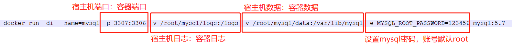

# Docker拉取MySQL镜像并启用(CentOS)

```shell
# 查找docker hub上的mysql镜像
docker search mysql

# pull mysql镜像
docker pull mysql:5.7
```

```shell
docker run -di --name=mysql -p 3307:3306 -v /root/mysql/logs:/logs -v /root/mysql/data:/var/lib/mysql -e MYSQL_ROOT_PASSWORD=123456 mysql:5.7
```

**-p** 3307:3306：将容器的 3306 端口映射到宿主机的 3307 端口
**-v** /root/mysql/logs:/logs：将主机目录(/root/mysql)下的 logs 目录挂载到容器中的/logs 日志目录
**-v** /root/mysql/data:/var/lib/mysql ：将宿主机目录(/root/mysql)下的data目录挂载到容器的 /var/lib/mysql 数据目录
**-e** MYSQL_ROOT_PASSWORD=123456：初始化 root 用户的密码

```shell
# 开通防火墙端口3306
firewall-cmd --zone=public --add-port=3306/tcp --permanent

# 更新防火墙
firewall-cmd --reload
```

```shell
docker run -p 3306:3306 --name mysql -v $PWD/conf:/etc/mysql/conf.d -v $PWD/logs:/logs -v $PWD/data:/var/lib/mysql -e MYSQL_ROOT_PASSWORD=123456 -d mysql:8.0
```

**-p** 3306:3306：将容器的 3306 端口映射到主机的 3306 端口。
**-v** $PWD/conf:/etc/mysql/conf.d：将主机当前目录下的 conf/my.cnf 挂载到容器的 /etc/mysql/my.cnf。
**-v** $PWD/logs:/logs：将主机当前目录下的 logs 目录挂载到容器的 /logs。
**-v** $PWD/data:/var/lib/mysql ：将主机当前目录下的data目录挂载到容器的 /var/lib/mysql 。
**-e** MYSQL_ROOT_PASSWORD=123456：初始化 root 用户的密码。

```shell
# 设置docker容器自启
docker update --restart=always 容器id

# docker进入到Mysql容器
docker exec -it 容器id(容器名) /bin/bash

# 进入后就和在linux的操作一致了
mysql -u root -p

# 使用 inspect 命令查看镜像详细信息(镜像的详细信息，其中，包括创建者，各层的数字摘要等)
docker inspect docker.io/mysql:5.7

# docker inspect 返回的是 JSON 格式的信息，如果您想获取其中指定的一项内容，可以通过 -f 来指定，如获取镜像大小：
docker inspect -f {{".Size"}} docker.io/mysql:5.7

# docker history 命令，可以列出各个层(layer)的创建信息，如我们查看 docker.io/mysql:5.7 的各层信息：
docker history docker.io/mysql:5.7
# 获取正在运行的容器mymysql的 IP
docker inspect --format='{{range .NetworkSettings.Networks}}{{.IPAddress}}{{end}}' mymysql

# 使用 tag 命令为镜像添加标签
docker tag docker.io/mysql:5.7 allen_mysql:5.7
```

