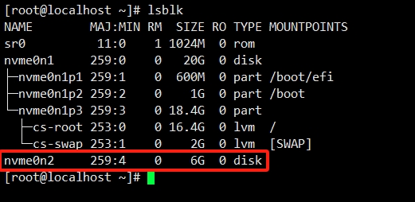
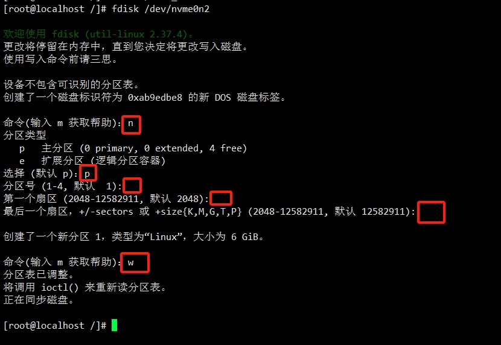
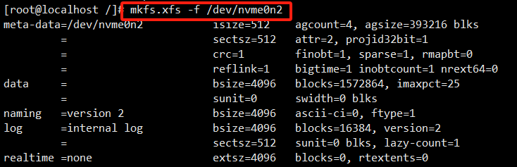
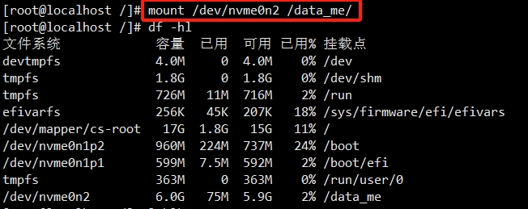
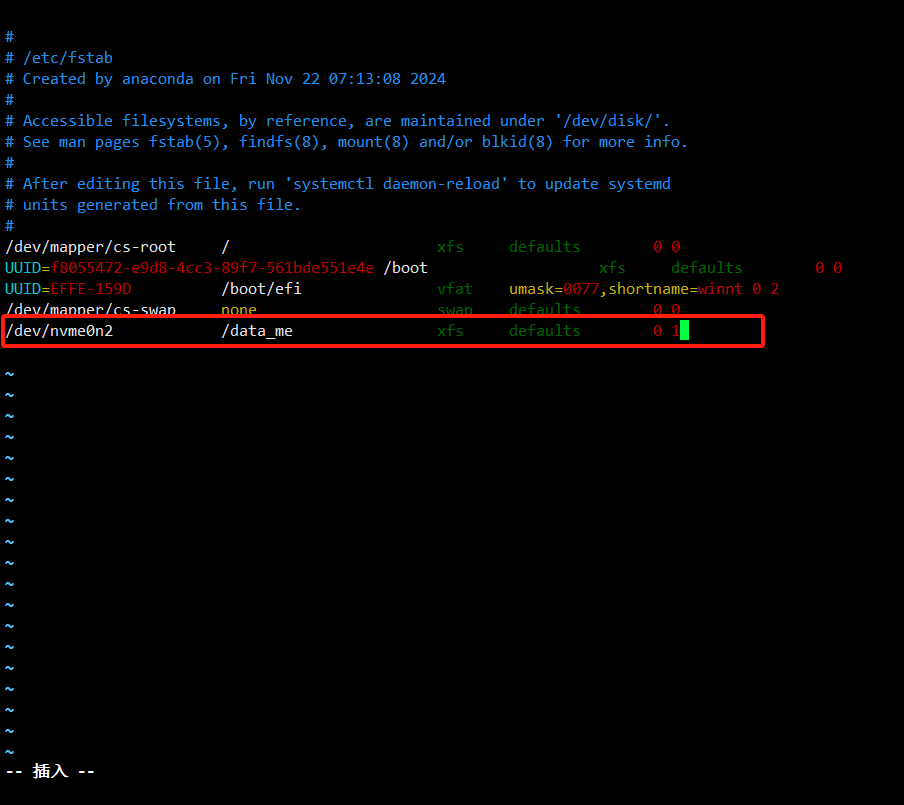

# Centos 挂载硬盘

### 查看服务器上未挂载的磁盘（磁盘有普通磁盘，高效磁盘，SSD磁盘）

```shell
fdisk -l

# lsblk查看分区 TYPE 为 disk 类型，且没有下分支的，即是没有被分区的硬盘。
lsblk
```




### 磁盘分区（分区有主分区，扩展 分区，逻辑分区）

```shell
# （/dev/nvme0n2为未挂载分区
fdisk /dev/nvme0n2

n->p->回车->回车->回车->w


n：添加一个分区
P：主分区
回车是默认
两个回车指是开始和结束的磁盘扇区大小
w：写入磁盘
```



### 格式化磁盘并写入文件系统

```shell
# 这里可以用xfs，也可以用ext4
mkfs.xfs -f /dev/nvme0n2
```



### 挂载新磁盘到操作系统的某个节点上

```shell
mkdir -pv /data_me

# 挂载硬盘到目录
mount /dev/nvme0n2 /data_me

# 取消目录挂载
umount /data_me
```

### 查看磁盘信息，确认挂载新磁盘是否成功

```shell
df -hl
```



### 设置开机启动自动挂载

```shell
# 新创建的分区不能开机自动挂载，每次重启机器都要手动挂载。
# 设置开机自动挂载需要修改/etc/fstab文件

vim /etc/fstab

# 打开后，在最后一行加入以下代码：

/dev/nvme0n2 /data_me xfs defaults 0 1  //如果上面用的是ext4，这里也要用ext4
```


