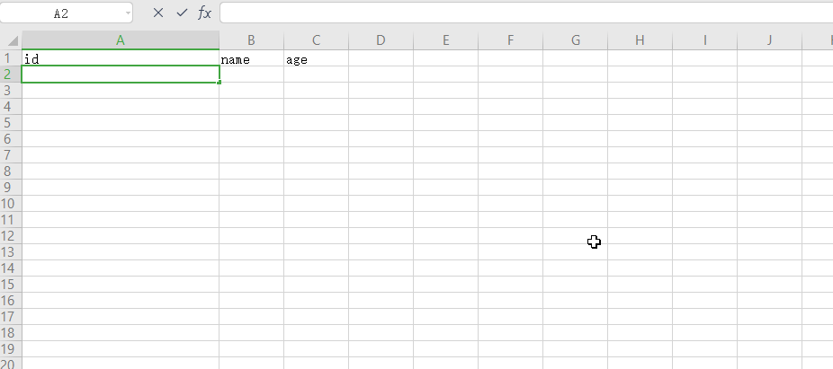

# Excel表格之——某一列生成UUID

#### 一 使用说明

将Navicat表格中的数据，导出为Excel文件，并使用Excel添加数据时，可能id字段需要一些UUID数据

#### 二 制作过程

#####  uuid格式

**格式一： 600d65bc-948a-1260-2217-fd8dfeebb1cd**

```excel
=LOWER(CONCATENATE(DEC2HEX(RANDBETWEEN(0,POWER(16,8)),8),"-",DEC2HEX(RANDBETWEEN(0,POWER(16,4)),4),"-","4",DEC2HEX(RANDBETWEEN(0,POWER(16,3)),3),"-",DEC2HEX(RANDBETWEEN(8,11)),DEC2HEX(RANDBETWEEN(0,POWER(16,3)),3),"-",DEC2HEX(RANDBETWEEN(0,POWER(16,8)),8),DEC2HEX(RANDBETWEEN(0,POWER(16,4)),4)))
```

**格式二： 600d65bc948a12602217fd8dfeebb1cd**

```excel
=LOWER(CONCATENATE(DEC2HEX(RANDBETWEEN(0,POWER(16,8)),8),"",DEC2HEX(RANDBETWEEN(0,POWER(16,4)),4),"","4",DEC2HEX(RANDBETWEEN(0,POWER(16,3)),3),"",DEC2HEX(RANDBETWEEN(8,11)),DEC2HEX(RANDBETWEEN(0,POWER(16,3)),3),"",DEC2HEX(RANDBETWEEN(0,POWER(16,8)),8),DEC2HEX(RANDBETWEEN(0,POWER(16,4)),4)))
```

**格式三： 4E3B14BB-ECF3-7B2E-A5A2-FE6E1A52DE6A **

```excel
=CONCATENATE(DEC2HEX(RANDBETWEEN(0,POWER(16,8)),8),"-",DEC2HEX(RANDBETWEEN(0,POWER(16,4)),4),"-","4",DEC2HEX(RANDBETWEEN(0,POWER(16,3)),3),"-",DEC2HEX(RANDBETWEEN(8,11)),DEC2HEX(RANDBETWEEN(0,POWER(16,3)),3),"-",DEC2HEX(RANDBETWEEN(0,POWER(16,8)),8),DEC2HEX(RANDBETWEEN(0,POWER(16,4)),4))
```

**格式四： 4E3B14BBECF37B2EA5A2FE6E1A52DE6A**

```excel
=CONCATENATE(DEC2HEX(RANDBETWEEN(0,POWER(16,8)),8),"",DEC2HEX(RANDBETWEEN(0,POWER(16,4)),4),"","4",DEC2HEX(RANDBETWEEN(0,POWER(16,3)),3),"",DEC2HEX(RANDBETWEEN(8,11)),DEC2HEX(RANDBETWEEN(0,POWER(16,3)),3),"",DEC2HEX(RANDBETWEEN(0,POWER(16,8)),8),DEC2HEX(RANDBETWEEN(0,POWER(16,4)),4))
```

###  制作过程

将鼠标定位到要生成uuid的表格中



