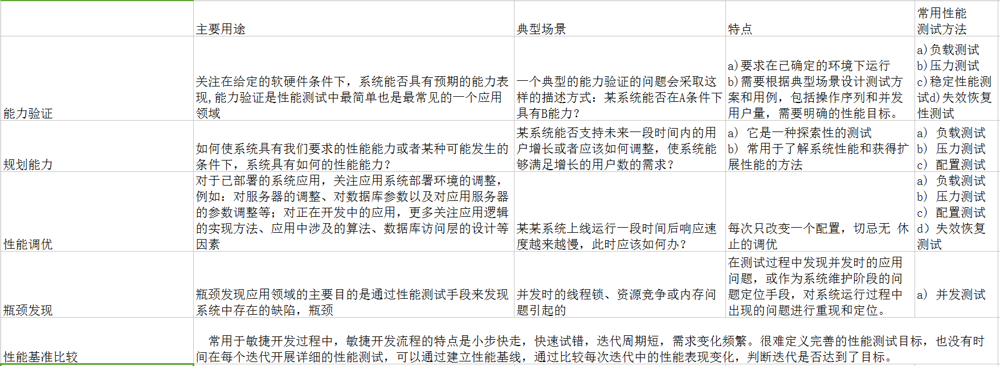
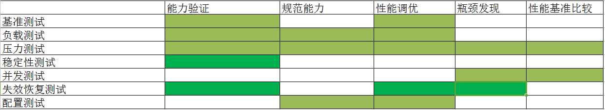
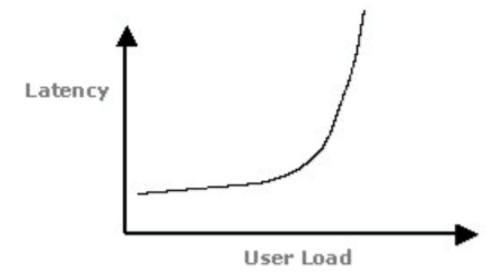
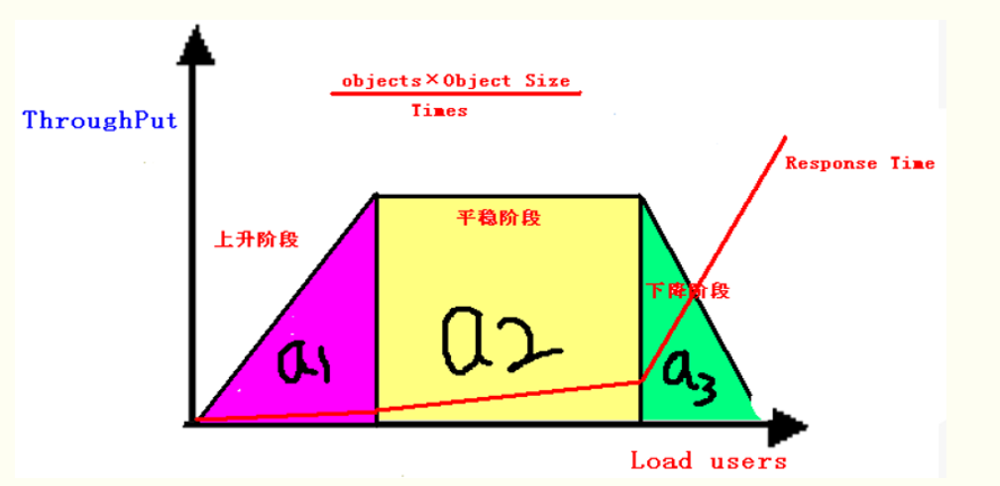
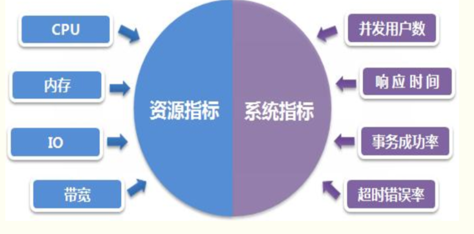
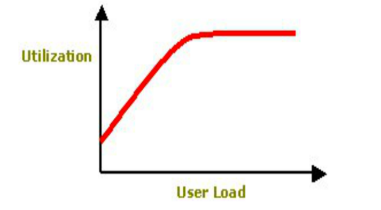
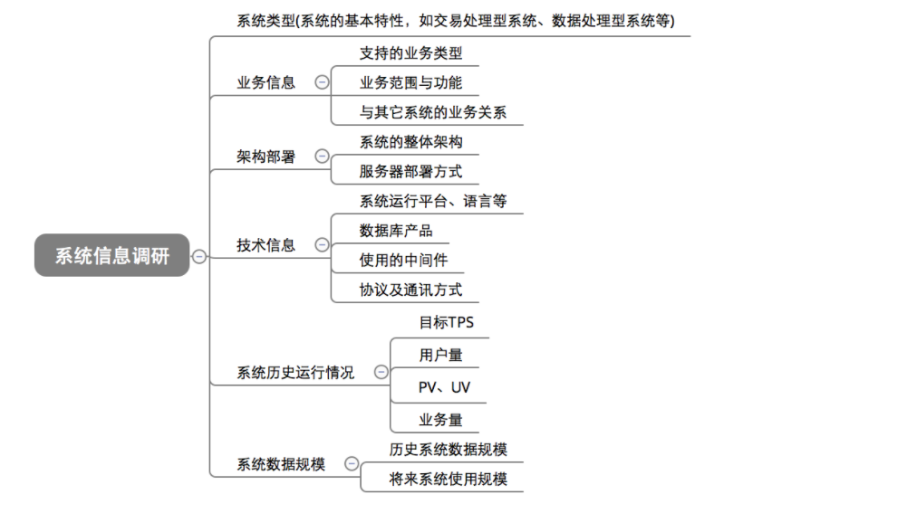
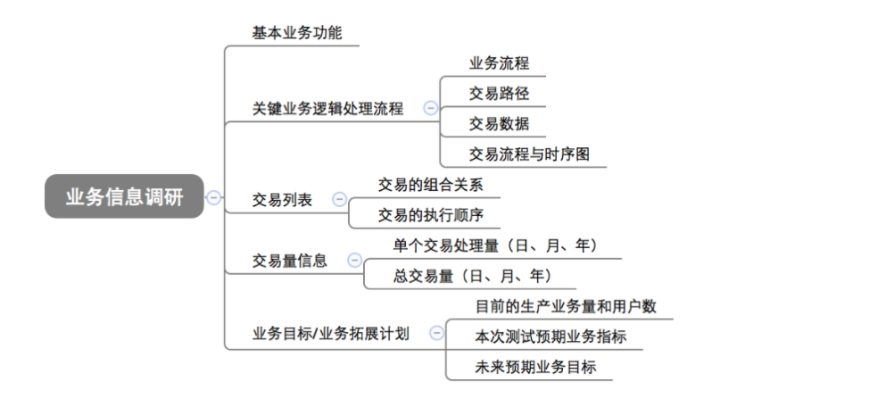
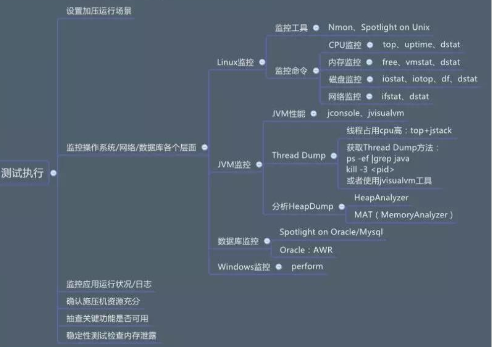

# 性能测试

## 概念

**定义**：软件的性能是软件的一种非功能特性，它关注的不是软件是否能够完成特定的功能，而是在完成该功能时展现出来的及时性。

由定义可知性能关注的是软件的非功能特性，所以性能测试介入的时机是在功能测试之后。在基础功能上测试验证完成、系统趋于稳定的情况下，才能进行性能测试，否则性能测试无意义。由于定义中的及时性可知性能是一种指标，可以用时间或者其他指标来衡量，通常我们会使用某些工具或者手段来检测软件的某些指标是否达到了要求，这就是性能测试。

**性能测试定义：**指通过自动化的测试工具模拟多种正常、峰值以及异常负载条件来对系统各项性能指标进行测试。

## 类型

- 基准测试：在给系统施加较低的压力时，查看系统的运行状况并记录相关数作为基础参考。

- 负载测试：指对系统不断增加压力或者增加一定压力的持续时间，直到系统的某项或多项性能达到安全临界值，不断加压使系统达到临界值，为调优提供参考值。

- 压力测试：

	1. 稳定性压力测试：在不同给定的条件下（比如内存的使用，一定时间段内有多少请求等），系统表现出来的处理，反应能力（这里会考虑系统容错能力，恢复能力）。

	2. 破坏性压力测试：不断加压，直至系统奔溃，挂掉，来得出系统的最大承受能力在哪儿。

- 稳定性测试：在给系统加载一定业务压力的情况下，使系统运行一段时间，以此检测系统是否稳定。

- 并发测试：测试多个用户同时访问同一个应用、同一个模块或者数据记录时是否存在死锁或者其他性的问题。

- 失效恢复测试：针对有多余备份和负载均衡的系统设计，检测如果系统发生局部故障，系统是否继续使用。

- 配置测试：通过对被测系统软硬件环境的调整，了解各种不同环境对系统性能影响的程度，从而找到系统各项资源的最优分配原则。

## 性能测试应用场景（领域）

**性能测试应用场景（领域）主要有：
能力验证、规划能力、性能调优、缺陷发现、性能基准比较，**

下表简单介绍和对比了这几个场景的各自用途和特点：

下表为性能测试应用领域与测试方法关联：

## 性能测试常用的指标

**1、响应时间（Response Time）**

定义：从用户发送一个请求到用户接收到服务器返回的响应数据这段时间就是响应时间

计算方法：Response time = （网络时间 + 应用程序处理时间）

合理的响应时间 2/5/10 （2秒之内给客户响应被用户认为是非常有吸引力的，5秒之内，比较糟糕，10秒之内，糟糕的用户体验，超过10秒，请求失败）

响应时间-负载对应关系：

图中拐点说明：

1、响应时间突然增加

2、意味着系统的一种或多种资源利用达到的极限

3、通常可以利用拐点来进行性能测试分析与定位

**2、吞吐量**

定义：单位时间内系统处理的客户端请求的数量

计算方法：Throughput = (number of requests) / (total time)

吞吐量-负载对应关系：

①上升阶段：吞吐量随着负载的增加而增加，吞吐量和负载成正比；

②平稳阶段：吞吐量随着负载的增加而保持稳定，无太大变化或波动；

③下降阶段：吞吐量随着负载的增加而下降，吞吐量和负载成反比；

 

*a1面积越大，说明系统的性能能力越强，a2面积越大，说明系统稳定性越好，a3面积越大，说明系统的容错能力越好*

**吞吐率**

吞吐量/传输时间，即单位时间内网络上传输的数据量，也可以指单位时间内处理客户请求数量，它是衡量网络性能的重要指标。

通常情况下，吞吐率用“字节数/秒”来衡量，当然，也可以用“请求数/秒”和“页面数/秒”来衡量；

**3、并发数**

①狭义上的并发：所有用户在同一时间点进行同样的操作，一般指同一类型的业务场景，比如1000个用户同时登陆系统；

②广义上的并发：多个用户与系统发生了交互，这些业务场景可以是相同的也可以是不同的，交叉请求和处理较多；

**4、资源利用率**

资源指标与硬件资源消耗直接相关，而系统指标则与用户场景及需求直接相关：

 

**资源指标：**
CPU使用率：指用户进程与系统进程消耗的CPU时间百分比，长时间情况下，一般可接受上限不超过85%；

内存利用率：内存利用率=（1-空闲内存/总内存大小）*100%，一般至少有10%可用内存，内存使用率可接受上限为85%；

磁盘I/O: 磁盘主要用于存取数据，因此当说到IO操作的时候，就会存在两种相对应的操作，存数据的时候对应的是写IO操作，取数据的时候对应的是是读IO操作，一般使用% Disk Time（磁盘用于读写操作所占用的时间百分比）度量磁盘读写性能；

网络带宽：一般使用计数器Bytes Total/sec来度量，其表示为发送和接收字节的速率，包括帧字符在内；判断网络连接速度是否是瓶颈，可以用该计数器的值和目前网络的带宽比较；

**系统指标：**
并发用户数：单位时间内与系统发生交互的用户数；

在线用户数：某段时间内访问系统的用户数，这些用户并不一定同时向系统提交请求；

平均响应时间：系统处理事务的响应时间的平均值；事务的响应时间是从客户端提交访问请求到客户端接收到服务器响应所消耗的时间；

事务成功率：性能测试中，定义事务用于度量一个或者多个业务流程的性能指标，如用户登录、保存订单、提交订单操作均可定义为事务，单位时间内系统可以成功完成多少个定义的事务，在一定程度上反应了系统的处理能力，一般以事务成功率来度量；

超时错误率：主要指事务由于超时或系统内部其它错误导致失败占总事务的比率；

**资源利用-负载对应关系：**

 

图中拐点说明：

1、服务器某件资源使用逐渐达到饱和

2、通常可以利用拐点来进行性能测试分析与定位

**5、其它常用概念：**

**TPS**

Transaction Per Second：每秒事务数，指服务器在单位时间内（秒）可以处理的事务数量，一般以request/second为单位；

QPS是查询，而TPS是事务，事务是查询的入口，也包含其他类型的业务场景，因此QPS应该是TPS的子集！

**QPS**

Query Per Second：每秒查询率，指服务器在单位时间内（秒）处理的查询请求速率；

TPS和QPS都是衡量系统处理能力的重要指标，一般和并发结合起来判断系统的处理能力；

**Thinking Time**

思考时间，在性能测试中，模拟用户的真实操作场景。用户操作的事务与事务之间是有一定间隔的，此时间内是不对服务器产生压力的，引入这个概念是为了并发测试（有交叉业务场景）时，业务场景比率更符合真实业务场景；

**PV**

Page View：页面浏览量，通常是衡量一个页面甚至网站流量的重要指标；

细分的话，有独立访问者数量、重复访问者数量、单独页面访问数量、用户停留时间等类型；

**RT/ART**

Response Time/average Response Time：响应时间/平均响应时间，指一个事务花费多长时间完成；

一般来说，性能测试中平均响应时间更有代表意义。细分的话，还有最小最大响应时间，50%、90%用户响应时间等；

# 性能测试流程

## 需求分析

**需要分析的系统信息**

 

**需要分析的业务信息**

 

image.png

**性能需求评估**

> 在实施性能测试之前，我们需要对被测系统做相应的评估，主要目的是明确是否需要做性能测试。如果确定需要做性能测试，需要进一步确立性能测试点和指标，明确该测什么、性能指标是多少，测试通过or不通过的标准？性能指标也会根据情况评估，要求被测系统能满足将来一定时间段的业务压力。
> 业务角度:
> 系统是公司内部 or 对外？系统使用的人数的多少？
> 系统角度：
> a）系统架构：b）数据库要求：c）系统特殊要求：

**确定性能测试点：**

- 关键业务：
  确定被测项目是否属于关键业务，有哪些主要的业务逻辑点，特别是跟交易相关的功能点。例如转账，扣款等接口。如果项目（或功能点）不属于关键业务（或关键业务点）
- 日请求量：
  确定被测项目各功能点的日请求量（可以统计不同时间粒度下的请求量如：小时，日，周，月）。如果日请求量很高，系统压力很大，而且又是关键业务，该项目需要做性能测试，而且关键业务点，可以被确定为性能点
- 逻辑复杂度：
  判定被测项目各功能点的逻辑复杂度。如果一个主要业务的日请求量不高，但是逻辑很复杂，则也需要通过性能测试。原因是，在分布式方式的调用中，当某一个环节响应较慢，就会影响到其它环节，造成雪崩效应。
- 运营推广活动：
  根据运营的推广计划来判定待测系统未来的压力。未雨绸缪、防患于未然、降低运营风险是性能测试的主要目标。被测系统的性能不仅能满足当前压力，更需要满足未来一定时间段内的压力。因此，事先了解运营推广计划，对性能点的制定有很大的作用。例如，运营计划做活动，要求系统每天能支撑多少 PV、多少 UV，或者一个季度后，需要能支撑多大的访问量等等数据。当新项目（或功能点）属于运营重点推广计划范畴之内，则该项目（或功能点）也需要做性能测试。

**建立性能指标**

> **a.选取核心业务流程（重要程度/频繁）
> b.并发用户数
> c.事物吞吐需求
> d.响应时间需求
> e.系统占用资源需求
> f.可扩展性需求**

**建立系统负载模型**

- 业务层面：
  （a）核心业务流程吞吐率
  （b）高峰期业务分布时段
- 系统负载：
  （a） 高峰/平常场景吞吐率
  （b）CPU/IO/MEM/NETWORK
- 数据来源：
  （a）服务器端监控
  （b）数据库日志
  （c）用户提出需求

**制定测试计划的实施时间和方案**

预设本次性能测试各子模块的起止时间和结束时间
测试环境的配置：局域网，虚拟机，操纵系统，数据库，中间件
参与人员：谁负责哪些任务，测试策略。
产出：测试方案，分析结果

## 搭建测试环境

**测试机环境**

> 执行机环境：这个就是用来生成负载的执行机，通常需要在物理机上运行。
> 负载工具：JDK/Eclipse/LoadRuner or Jmeter或Galting等
> 监控工具：准备性能测试时的服务器资源、JVM、数据库监控工具，以便进行后续的性能测试分析与调优

**服务器环境**

> 系统运行环境：这个通常就是我们的测试环境，Linux系统/数据库/应用服务/各种监控工具。
> 大部分公司的测试环境会低于生产环境，同时还需要考虑到不同的硬件配置是否会是制约系统性能的重要因素！因此在测试环境中，需要部署多个不同的测试环境，在不同的硬件配置上检查应用系统的性能，配置大概是如下几类：
> ①数据库服务器
> ②应用服务器
> ③负载模拟器
> ④软件运行环境，
> 平台并对不同配置下系统的测试结果进行分析，得出最优结果（最适合当前系统的配置）

## 测试场景设计

通过和业务部门沟通以及以往用户操作习惯，确定用户操作习惯模式，以及不同的场景用户数量，操作次数，确定测试指标，以及性能监控等

## 测试用例设计和脚本开发

选择LoadRuner或者Jmeter，我使用的是Jmeter。

我使用Jmeter的工具进行录制，
(PS:能直接写脚本就自己写尽量少录制，录制有时候会有干扰)

**对脚本进行修改，增强脚本，让脚本更符合业务逻辑，可用性更强。**
（1）参数化用户输入
（2）关联数据
（3）增加事物
（4增加检查点）

**调试脚本**
（1）Vugen单次回放
（2）Vugen多次回放
（3）Controller单脚本多用户
（4）Controller多脚本多用户
（5）查看回放日志

**验证脚本**
（1）通过检查点验证
（2）通过查看后台服务器日志验证
（3）通过测试系统查看运行后台变化
（4）利用SQL语句查询/插入/更新/修改，查看效果

## 测试数据准备

获取数据有两种方式：

（1）拉取生产数据，尽量保持数据一致以及量级足够
（2）利用脚本自动生成数据或者利用测试工具生成数据，（如：利用JDBC预埋数据）

a）负载测试数据：并发测试时需要多少数据？比如登录场景？

b）DB数据量大小：为了尽量符合生产场景，需要模拟线上大量数据情况，那么要往数据库里提前插入一定的数据量。

## 性能测试执行和管理

**执行测试脚本**

在已部署好的测试环境中，按照业务场景和编号，按顺序执行我们已经设计好的测试脚本

**测试结果记录**

根据测试采用的工具不同，结果的记录也有不同的形式；展现方式：折线图，统计图，表格等，现在大多的性能测试工具都提供比较完整的界面图形化的测试结果，当然，对于服务器的资源使用等情况，可以利用一些计数器或第三方监控工具来对其进行记录，执行完测试后，对结果进行整理分析，

 

## 性能测试结果分析与调优

**测试环境的系统性能分析**

根据之前记录得到的测试结果，经过计算，与预定的性能指标进行对比，确定是否达到了我们需要的结果；如未达到，查看具体的瓶颈点，然后根据瓶颈点的具体数据，

> **瓶颈定位分析**
> 吞吐量：二八原则 （即：80%的业务在20%的时间内完成/正太分布）
> 响应时间：2/5/10原则
> 内存，磁盘，IO，进程，网络分析
> 硬件，操作系统，中间件，应用瓶颈
> 进行具体情况具体分析

> **性能调优**
> 时间资源，人力资源
> 硬件资源，扩展性，影响

**硬件设备对系统性能表现的影响分析**

配置几个不同的测试环境，故可以根据不同测试环境的硬件资源使用状况图进行分析，确定瓶颈是再数据库服务器、应用服务器抑或其他方面，然后针对性的进行优化等操作

**其他影响因素分析**

影响系统性能的因素很多，可以从用户能感受到的场景分析，哪里比较慢，哪里速度尚可，这里可以根据2\5\8原则对其进行分析；
至于其他诸如网络带宽、操作动作、存储池、线程实现、服务器处理机制等一系列的影响因素，具体问题具体分析，

**测试中发现的问题**

在性能测试执行过程中，可能会发现某些功能上的不足或存在的缺陷，以及需要优化的地方，需要多次执行测试。

## 测试报告和跟踪

**性能测试报告是性能测试的里程碑，通过报告能展示出性能测试的最终成果，展示系统性能是否符合需求，是否有性能隐患**

> **性能测试报告中需要阐明:**
> 性能测试目标、
> 性能测试环境、
> 性能测试数据构造规则、
> 性能测试策略、
> 性能测试结果、
> 性能测试调优说明、
> 性能测试过程中遇到的问题和解决办法等。

**性能测试工程师完成该次性能测试后，需要将测试结果进行备案，并做为下次性能测试的基线标准，具体包括性能测试结果数据、性能测试瓶颈和调优方案等。同时需要将测试过程中遇到的问题，包括代码瓶颈、配置项问题、数据问题和沟通问题，以及解决办法或解决方案，进行知识沉淀。**
